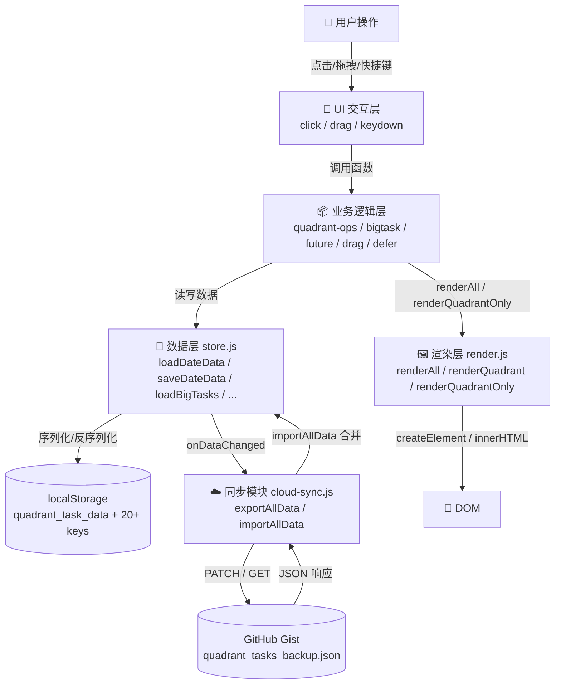
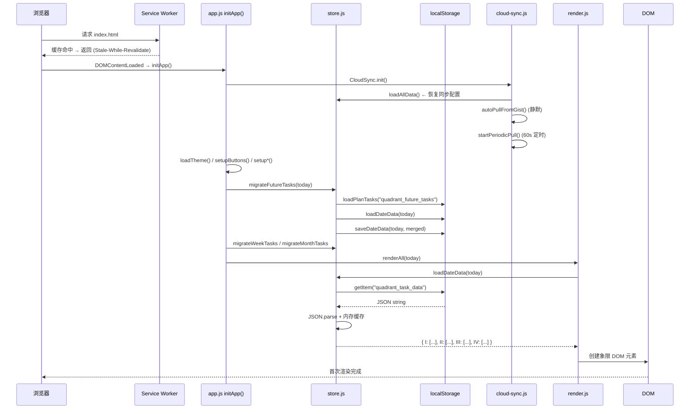
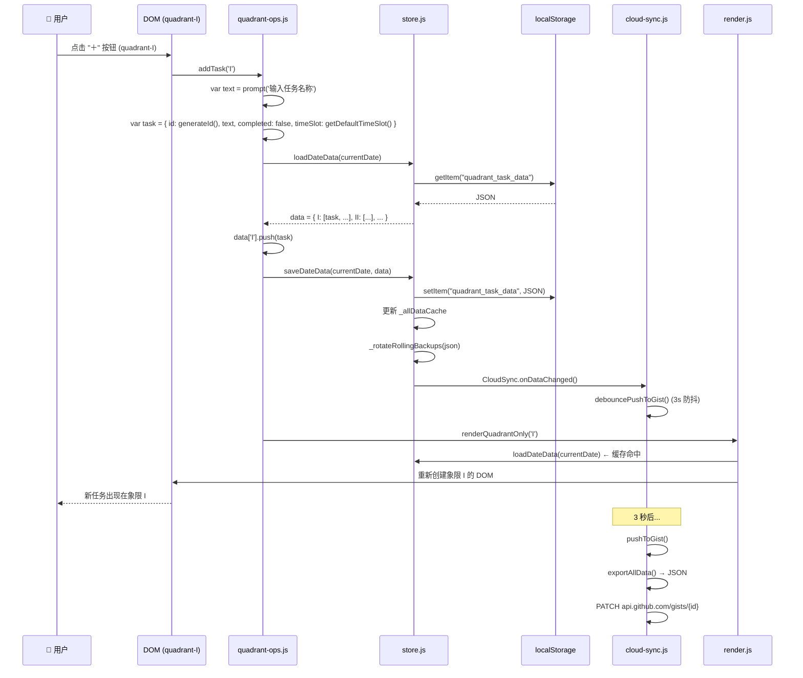
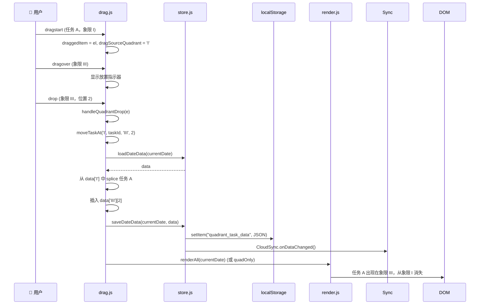
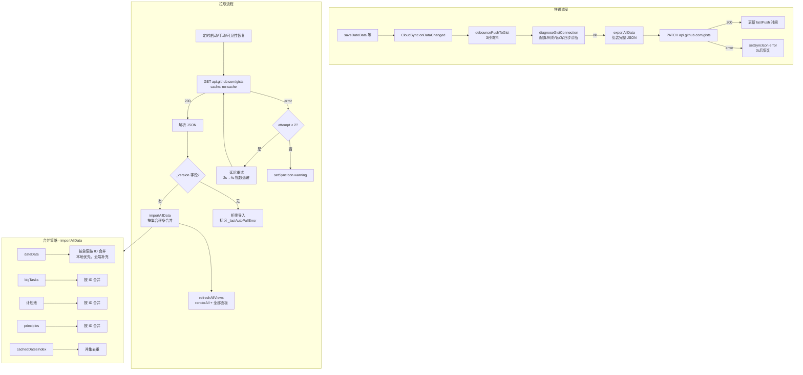
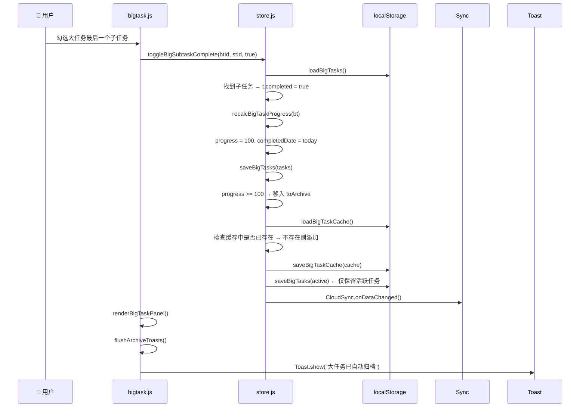
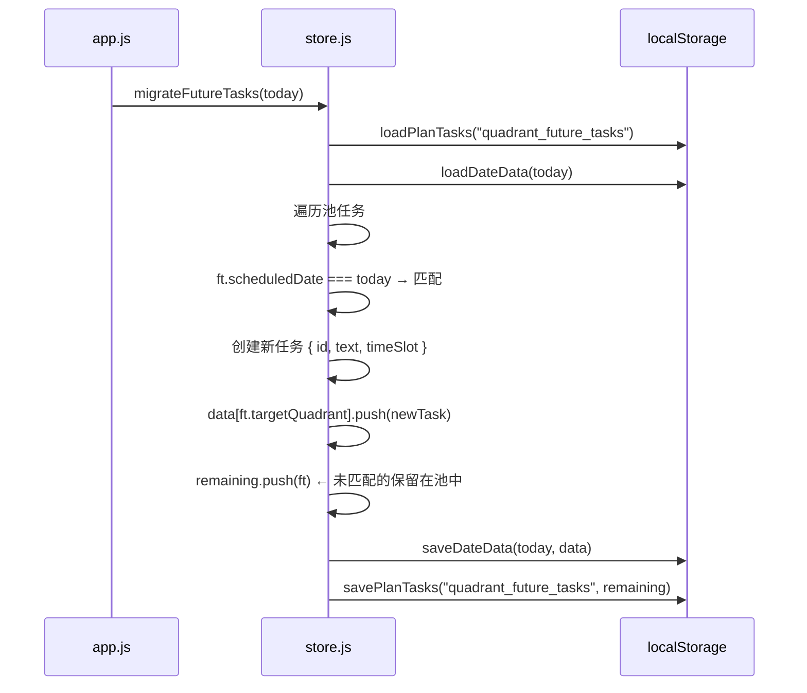
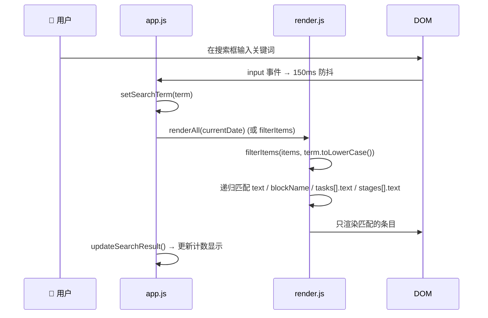
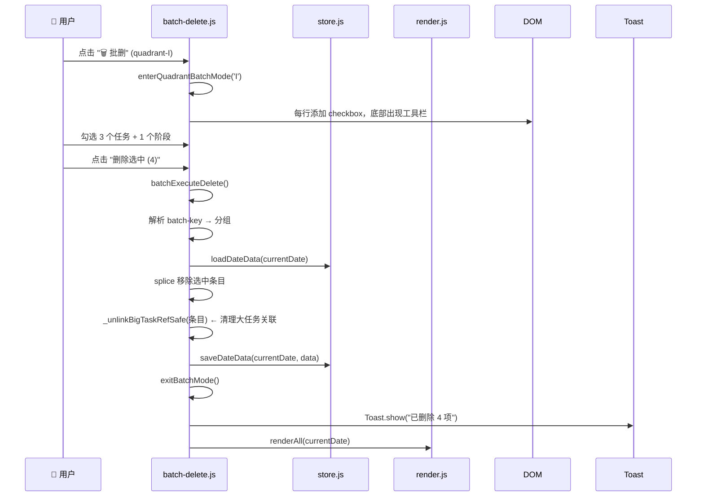
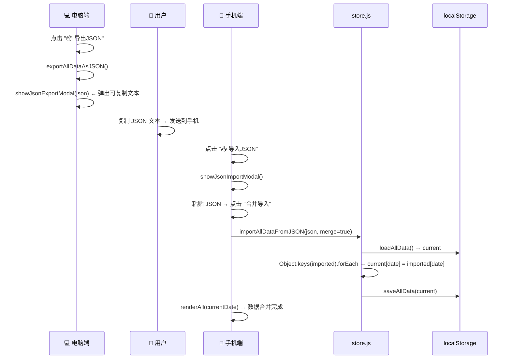

# 数据流文档 — 四象限任务管理器

> 使用 Mermaid 描述整个项目的数据流，涵盖用户操作到持久化到云端的完整链路。

---

## 1. 顶层数据流

---

## 2. 初始化数据流

---

## 3. 用户添加任务数据流

---

## 4. 拖拽任务数据流（跨象限）

---

## 5. 云同步完整数据流

---

## 6. 大任务完成 → 自动归档数据流

---

## 7. 计划池 → 今日 Q-II 迁移数据流

---

## 8. 搜索过滤数据流

---

## 9. 批量删除数据流

---

## 10. JSON 跨设备导入数据流

